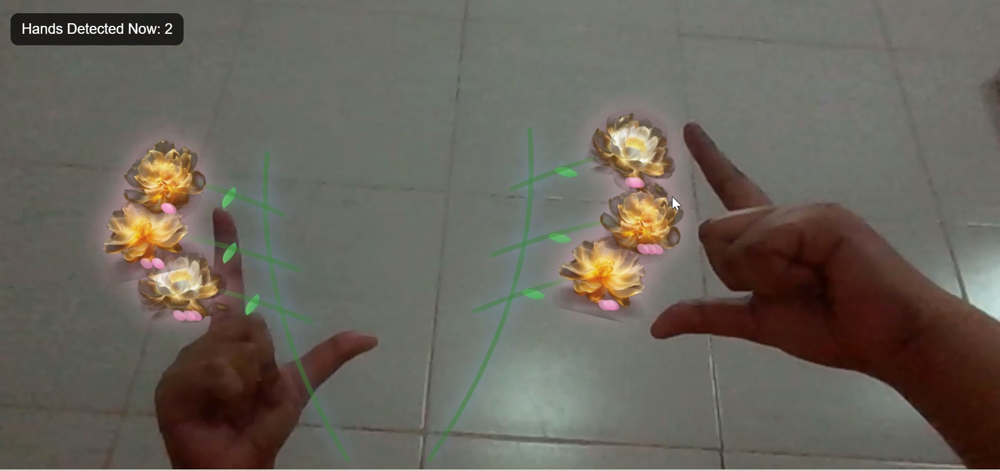
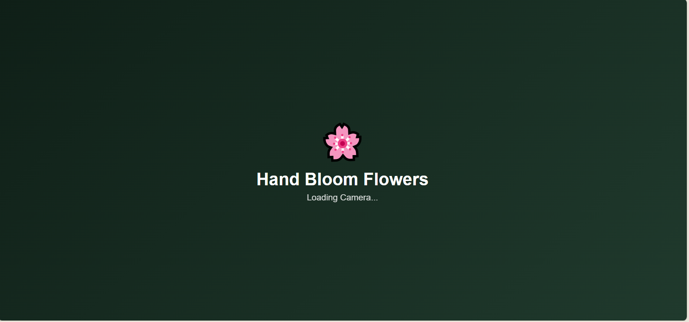
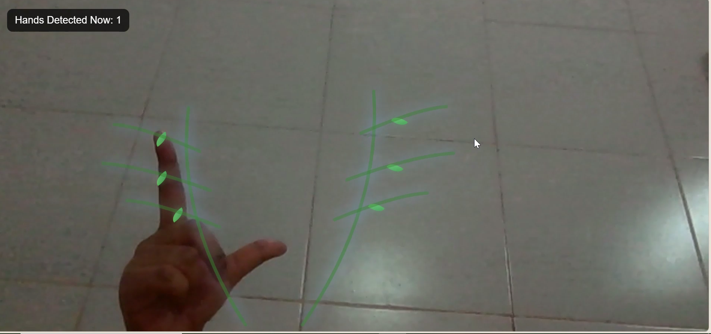
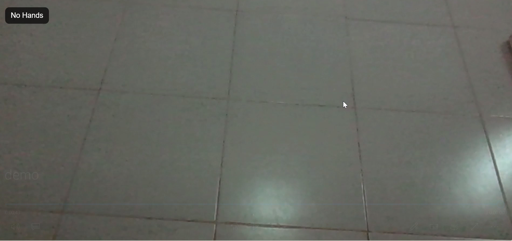

# 🌸 Hand Bloom Flowers



An interactive web application that uses real-time hand tracking to transform hand gestures into a magical blooming flower experience.

Using real-time hand tracking powered by MediaPipe, users can grow elegant flower stems with one hand and bloom flowers with the other, creating a magical and immersive nature-inspired interaction.

---
## 🎥 Project Demo

Experience the interactive flower blooming animation powered by real-time hand tracking.

📹 **Demo Video:** [Watch the Demo](assets/demo.mp4)
---
## 📸 Screenshots

### 🌱 Loading Screen



### ✋ One Hand Growth



### 🌸 Full Bloom


### 🙌 No Hands Detected



---
## ✨ Features

- 🌿 Grow flower stems using hand gestures
- 🌸 Bloom flowers in real time
- 🍃 Animated leaves
- ✨ Bloom glow effect
- 🌸 Falling petals
- 💫 Bloom ripple animation
- 🌬️ Gentle stem sway
- 🎥 Live webcam interaction using MediaPipe Hands
- 📱 Clean and responsive interface

---

## 🛠️ Technologies Used

- HTML5
- CSS3
- JavaScript (ES6)
- MediaPipe Hands
- SVG
- Web Camera API

---

## 🚀 How It Works

1. Allow camera access.
2. Show both hands in front of the camera.
3. Use your **left hand** to grow the flower stems.
4. Use your **right hand** to bloom the flowers.
5. Watch the flowers bloom with glowing effects, falling petals, ripple animations, and gentle movement.

---

## 📂 Project Structure

```text
Hand-Bloom-Flowers/
│
├── assets
├── index.html
├── script.js
├── style.css
└── README.md
```


---

## 🌱 Future Improvements

- More flower varieties
- Seasonal themes
- Different bloom styles
- Sound effects
- Mobile gesture support
- Improved hand gesture recognition

---

## 👩‍💻 Author

**Aditi Bansal**

BCA Student | Web Developer | Passionate about Creative Frontend Development

---

⭐ If you enjoyed this project, don't forget to star the repository.